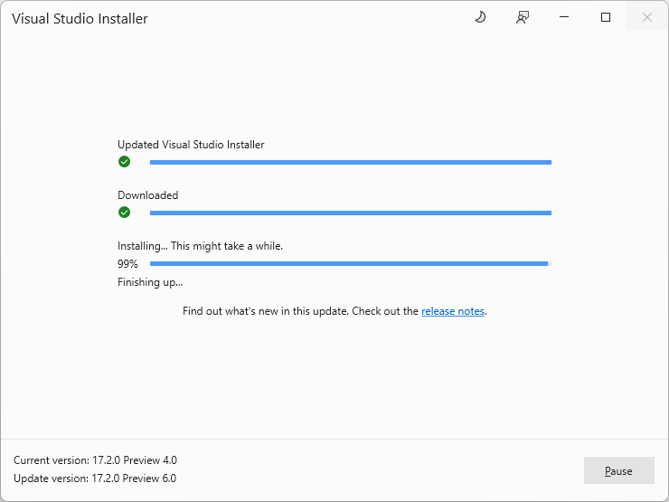
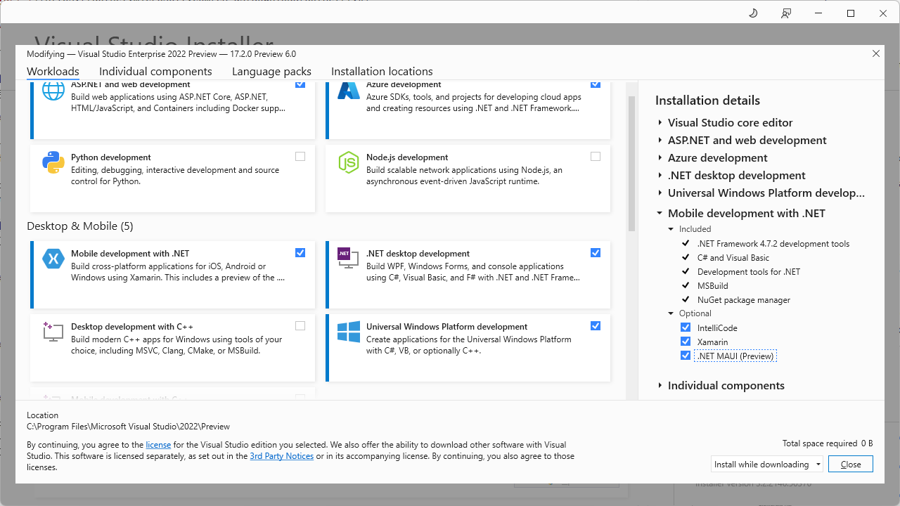
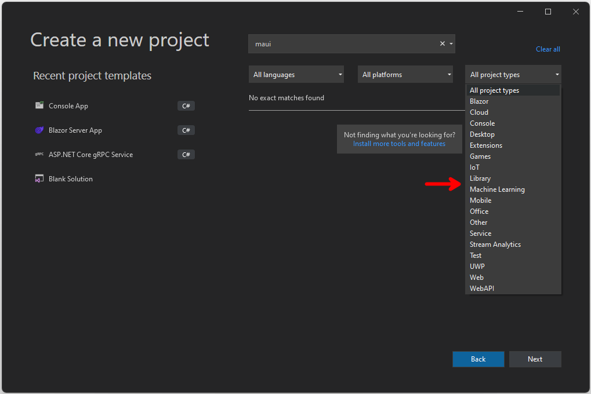
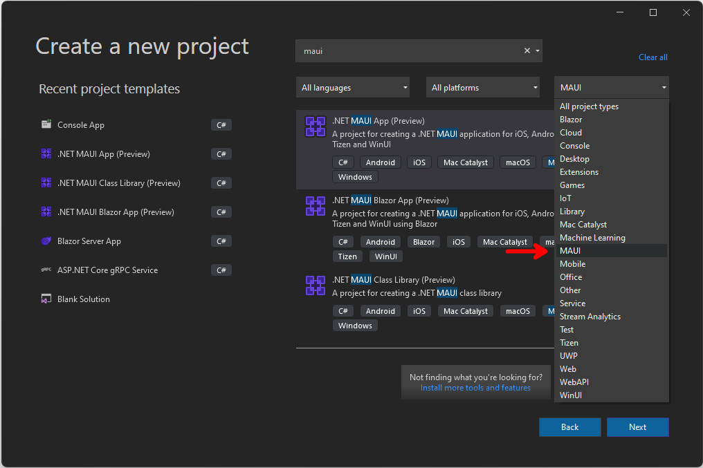
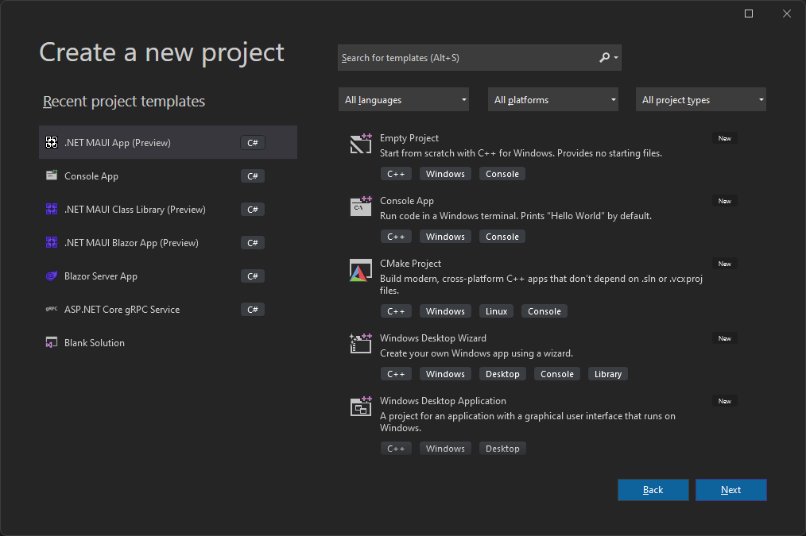
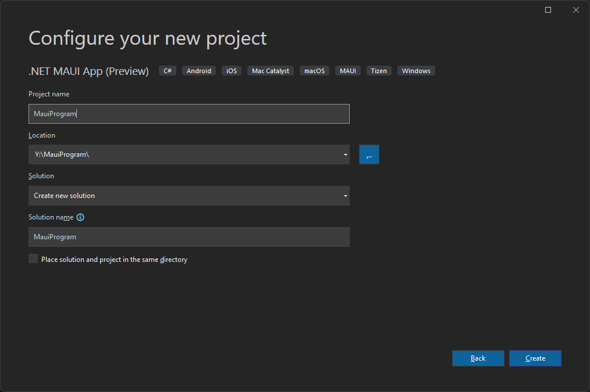
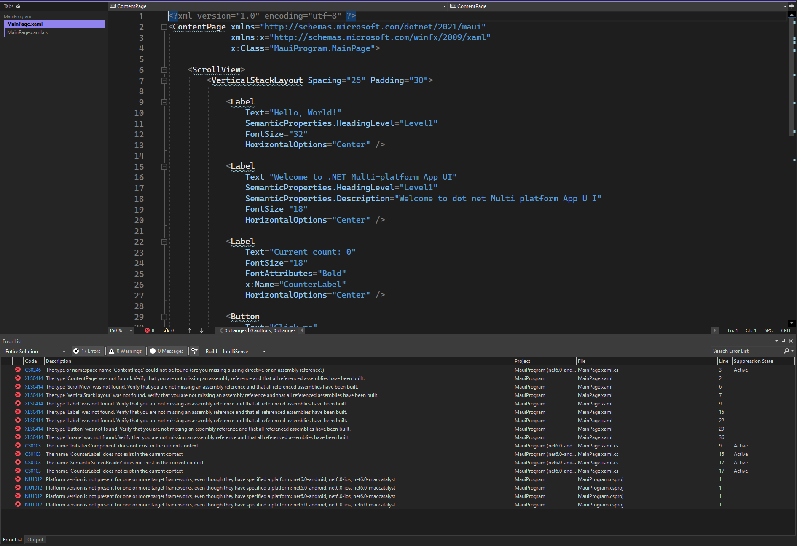
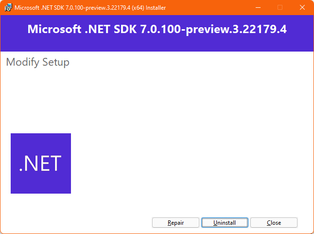
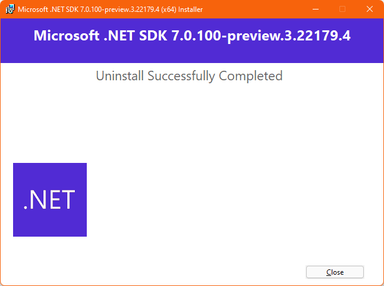

# Table of Contents

- [Table of Contents](#table-of-contents)
  - [MAUIProgram](#mauiprogram)
  - [Prerequisites](#prerequisites)
    - [Visual Studio 2022 Preview](#visual-studio-2022-preview)
    - [Mobile Development with .NET Workload](#mobile-development-with-net-workload)
    - [MAUI Templates Missing](#maui-templates-missing)
  - [Demo](#demo)
    - [Create a MAUI Application](#create-a-maui-application)
  - [Complete Code](#complete-code)
  - [Resources](#resources)

## MAUIProgram

ADD TEXT HERE -----------------------------

## Prerequisites

### Visual Studio 2022 Preview

For this demo, we are going to use the latest version of [Visual Studio 2022 Preview](https://visualstudio.microsoft.com/vs/community/).

In my case, I already have [Visual Studio 2022 Preview](https://visualstudio.microsoft.com/vs/community/) installed, so the first thing I am going to do, is update it from Preview 4.0 to 6.0.

  

>:memo: Everything covered in this demo, is also available in Preview 1, but I like to update to the latest for good measure.

### Mobile Development with .NET Workload

If you have been following [The .NET Show](https://www.youtube.com/playlist?list=PL8h4jt35t1wgW_PqzZ9USrHvvnk8JMQy_) you know that in order to build MAUI apps, the Mobile Development with .NET Workload workload needs to be installed, as well as the .NET MAUI (Preview), so if you do not have that installed you can do that now.

  

### MAUI Templates Missing

As I tried to create a MAUI Application, I noticed that the MAUI templates were missing:

  

>:point_up: If the MAUI Templates are missing, they can be installed running ```dotnetcli dotnet new -i Microsoft.Maui.Templates```

So, first I listed all installed templates by running ```dotnetcli dotnet new --list```, this was the output:

```dotnetcli
dotnet new --list
These templates matched your input:

Template Name                                 Short Name           Language    Tags
--------------------------------------------  -------------------  ----------  -------------------------------------
ASP.NET Core Empty                            web                  [C#],F#     Web/Empty
ASP.NET Core gRPC Service                     grpc                 [C#]        Web/gRPC
ASP.NET Core Web API                          webapi               [C#],F#     Web/WebAPI
ASP.NET Core Web App                          webapp,razor         [C#]        Web/MVC/Razor Pages
ASP.NET Core Web App (Model-View-Controller)  mvc                  [C#],F#     Web/MVC
ASP.NET Core with Angular                     angular              [C#]        Web/MVC/SPA
ASP.NET Core with React.js                    react                [C#]        Web/MVC/SPA
ASP.NET Core with React.js and Redux          reactredux           [C#]        Web/MVC/SPA
Blazor Server App                             blazorserver         [C#]        Web/Blazor
Blazor WebAssembly App                        blazorwasm           [C#]        Web/Blazor/WebAssembly/PWA
Class Library                                 classlib             [C#],F#,VB  Common/Library
Console App                                   console              [C#],F#,VB  Common/Console
dotnet gitignore file                         gitignore                        Config
Dotnet local tool manifest file               tool-manifest                    Config
EditorConfig file                             editorconfig                     Config
global.json file                              globaljson                       Config
MSTest Test Project                           mstest               [C#],F#,VB  Test/MSTest
MVC ViewImports                               viewimports          [C#]        Web/ASP.NET
MVC ViewStart                                 viewstart            [C#]        Web/ASP.NET
NuGet Config                                  nugetconfig                      Config
NUnit 3 Test Item                             nunit-test           [C#],F#,VB  Test/NUnit
NUnit 3 Test Project                          nunit                [C#],F#,VB  Test/NUnit
Protocol Buffer File                          proto                            Web/gRPC
Protocol Buffer File                          proto                            Web/gRPC
Razor Class Library                           razorclasslib        [C#]        Web/Razor/Library/Razor Class Library
Razor Component                               razorcomponent       [C#]        Web/ASP.NET
Razor Page                                    page                 [C#]        Web/ASP.NET
Solution File                                 sln                              Solution
Web Config                                    webconfig                        Config
Windows Forms App                             winforms             [C#],VB     Common/WinForms
Windows Forms Class Library                   winformslib          [C#],VB     Common/WinForms
Windows Forms Control Library                 winformscontrollib   [C#],VB     Common/WinForms
Worker Service                                worker               [C#],F#     Common/Worker/Web
WPF Application                               wpf                  [C#],VB     Common/WPF
WPF Class library                             wpflib               [C#],VB     Common/WPF
WPF Custom Control Library                    wpfcustomcontrollib  [C#],VB     Common/WPF
WPF User Control Library                      wpfusercontrollib    [C#],VB     Common/WPF
xUnit Test Project                            xunit                [C#],F#,VB  Test/xUnit
```

Then, I installed the missing MAUI templates by running ```dotnetcli dotnet new -i Microsoft.Maui.Templates```, and this was the output:

```dotnetcli
dotnet new -i Microsoft.Maui.Templates
The following template packages will be installed:
   Microsoft.Maui.Templates

Success: Microsoft.Maui.Templates::6.0.300-rc.2.5513 installed the following templates:
Template Name                                  Short Name        Language  Tags
---------------------------------------------  ----------------  --------  ---------------------------------------------------------
.NET MAUI App (Preview)                        maui              [C#]      MAUI/Android/iOS/macOS/Mac Catalyst/Windows/Tizen
.NET MAUI Blazor App (Preview)                 maui-blazor       [C#]      MAUI/Android/iOS/macOS/Mac Catalyst/WinUI/Tizen/Blazor
.NET MAUI Class Library (Preview)              mauilib           [C#]      MAUI/Android/iOS/macOS/Mac Catalyst/Windows/Tizen
.NET MAUI ContentPage (C#) (Preview)           maui-page-csharp  [C#]      MAUI/Android/iOS/macOS/Mac Catalyst/WinUI/Tizen/Xaml/Code
.NET MAUI ContentPage (XAML) (Preview)         maui-page-xaml    [C#]      MAUI/Android/iOS/macOS/Mac Catalyst/WinUI/Tizen/Xaml/Code
.NET MAUI ContentView (C#) (Preview)           maui-view-csharp  [C#]      MAUI/Android/iOS/macOS/Mac Catalyst/WinUI/Tizen/Xaml/Code
.NET MAUI ContentView (XAML) (Preview)         maui-view-xaml    [C#]      MAUI/Android/iOS/macOS/Mac Catalyst/WinUI/Tizen/Xaml/Code
.NET MAUI ResourceDictionary (XAML) (Preview)  maui-dict-xaml    [C#]      MAUI/Android/iOS/macOS/Mac Catalyst/WinUI/Xaml/Code
```

:exclamation: MAUI templates are back!

  

Now we can proceed with the demo.

## Demo

The following demo is a MAUI application where I will show you the new MAUIProgram.cs changes.

### Create a MAUI Application

  

  

First thing we notice, is that the project will not build.



:warning: If you followed my previous video [Native AOT in .NET 7. The .NET Show with Carl Franklin Ep 21](https://www.youtube.com/watch?v=4THfSynZLq8&list=PL8h4jt35t1wgW_PqzZ9USrHvvnk8JMQy_&index=21) you may run into the same issue, so follow along.

After spending a couple of hours trying to get my environment back in a working state, I finally figured out the reason, the .NET 7 SDK 7.0.100-preview.3.22179.4 needs to be uninstalled. The easiest way to do that, is to run the installer used to install it and click Uninstall.



  

## Complete Code

- <https://github.com/payini/MauiProgram>

## Resources

| Resource Title                   | Url                                                                                   |
| -------------------------------- | ------------------------------------------------------------------------------------- |
| The .NET Show with Carl Franklin | <https://www.youtube.com/playlist?list=PL8h4jt35t1wgW_PqzZ9USrHvvnk8JMQy_>            |
| MAUI Templates Missing           | <https://github.com/dotnet/maui/issues/5355?msclkid=6320df98ce5011ec9343dac76b4764f4> |